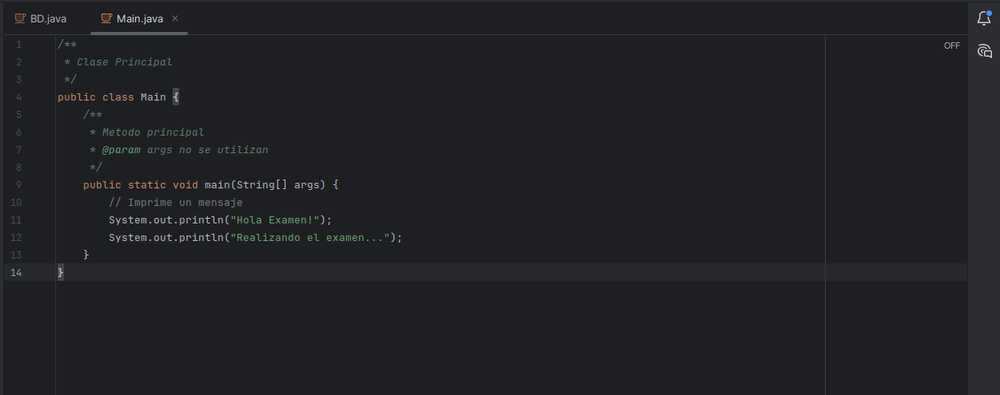
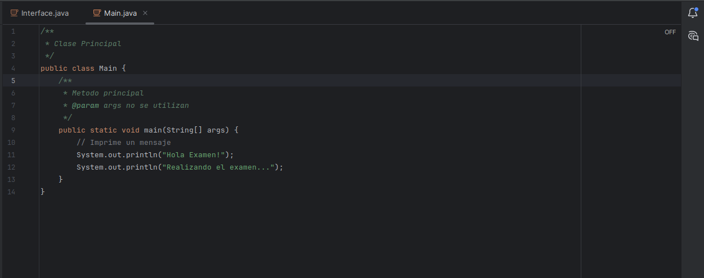
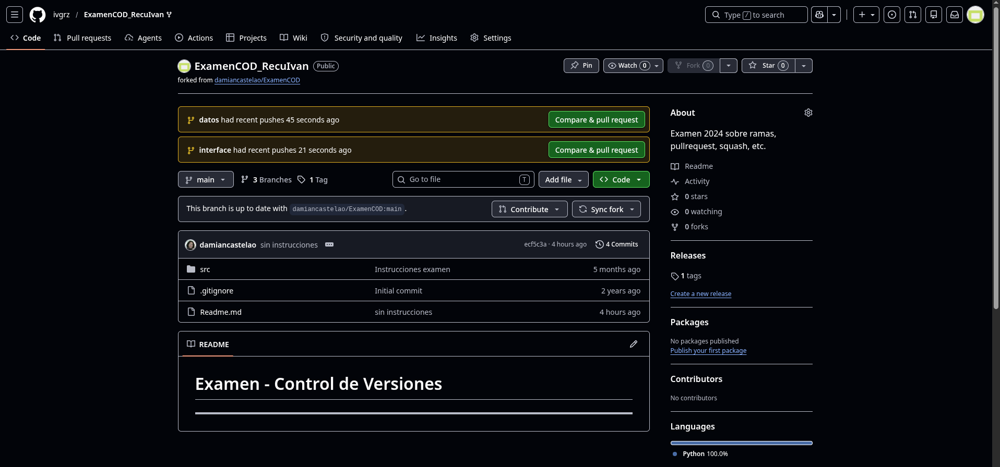

# Examen - Control de Versiones

---
## Alumno: Ivan Gutierrez

### Realizamos nuevos cambios en las ramas que vamos a fusionar 

### Guardamos el commit de ambas ramas

### Realizamos el push de ambos commits para actualizar las ramas 

