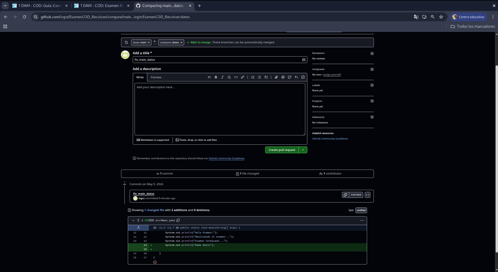
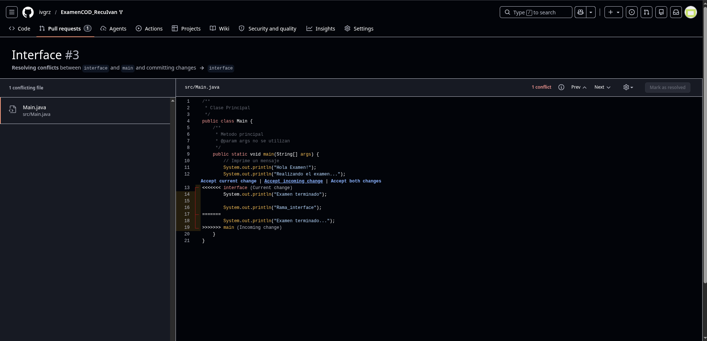
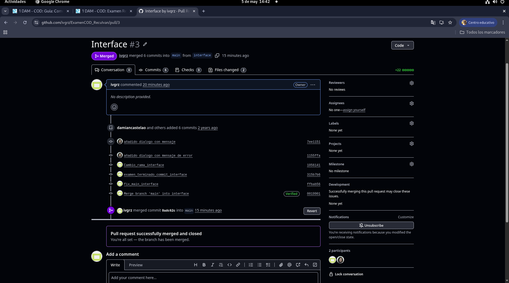
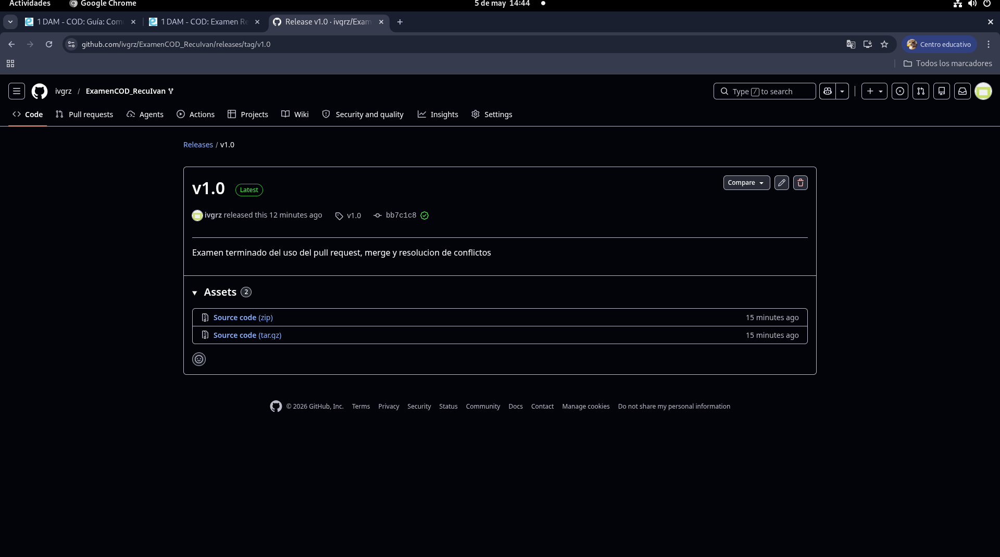

# Examen - Control de Versiones

---
## Alumno: Ivan Gutierrez

### Realizamos nuevos cambios en las ramas que vamos a fusionar 

### Guardamos el commit de ambas ramas

### Realizamos el push de cada rama para actualizarlas 

### Realizamos el pull request y merge de ambas ramas

-  Resolucion de conflicto de rama interface

- Merge sin conflictos de la rama datos

### Realizamos la etiqueta v1.0 vinculada al ultimo commit 

